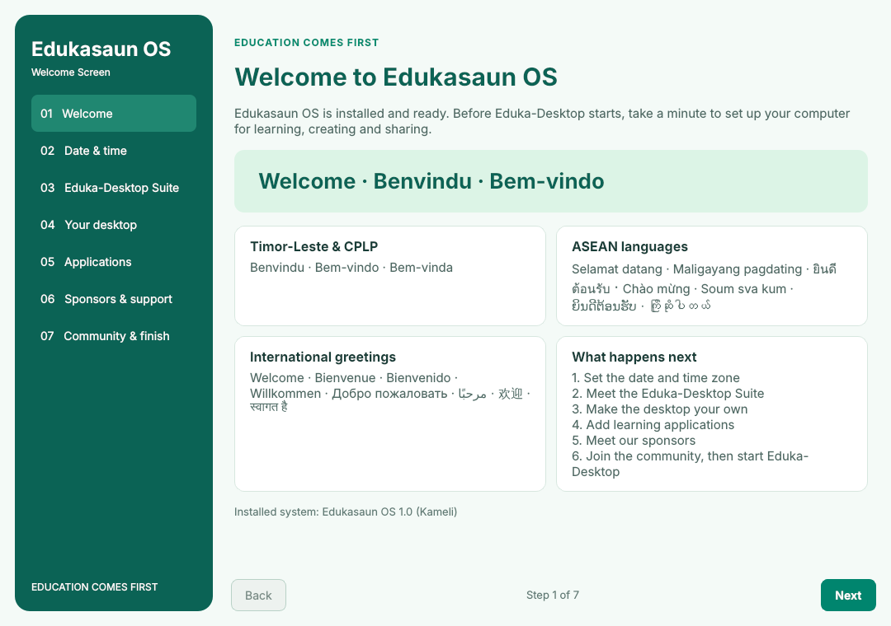

# Edukasaun Welcome

The **Welcome Screen** for **Edukasaun OS** — a native **Python / Qt 6** application for Debian 13 (Trixie), LXQt and the **Eduka-Desktop Suite**.

> **Development build.** This is work in progress and will keep being revised. The interface is English only and does not show a version number.



## What the Welcome Screen does

1. **Comes first.** At login, the Welcome Screen runs *before* Eduka-Desktop. When the user finishes (or closes it), it starts Eduka-Desktop.
2. **Only on an installed system.** On the live image nothing is shown: the session gate detects live boots (`boot=live` / `boot=casper` on the kernel command line, or a mounted live medium such as `/run/live/medium`) and starts Eduka-Desktop directly.
3. **Every login until turned off.** "Show the Welcome Screen every time I log in" (on the last page) is checked by default. When unchecked, Eduka-Desktop starts directly. The Welcome Screen can still be opened from the application menu. Preferences are saved in `$XDG_CONFIG_HOME/edukasaun-welcome/preferences.json` (normally `~/.config/edukasaun-welcome/`).

## Seven pages

| Page | Contents |
| --- | --- |
| 1. Welcome | Greetings from Timor-Leste & CPLP, ASEAN and around the world; overview of the setup steps; installed system name |
| 2. Date & time | Time zone list that **always starts from Asia/Dili (Timor-Leste)**, search, live clock preview with UTC offset, 24/12-hour clock format, automatic time (NTP) or manual date and time, Apply |
| 3. Eduka-Desktop Suite | Eduka-Desktop, Eduka-Menu, Eduka-Panel, Eduka-Menu-Settings; project tools EUS, Eduka-Konekta, Eduka-Block; About |
| 4. Your desktop | **All Eduka-Desktop Suite settings** with a live panel preview (see below), plus LXQt theme, icons, accent color and wallpaper |
| 5. Applications | Additional recommendations only; APT/Flatpak/Brave sources; pre-install rescan; authentication, live output and inventory export |
| 6. Sponsors & support | Sponsor and partner **logos**, PayPal donation, how to become a sponsor, contributing on GitHub |
| 7. Community & finish | Website, Facebook, WhatsApp, GitHub (https://github.com/hugomonizdorego); goals; development team; startup preference; **Start Eduka-Desktop** |

Every page after the first has Back. All settings are optional; Next skips them.

## Your desktop: Eduka-Desktop settings

Page 4 offers everything Eduka-Menu-Settings (Eduka-Desktop 0.9.10) offers, except maintenance actions, in five tabs:

| Tab | Settings |
| --- | --- |
| Theme & effects | Visual theme (Eduka-Default-Theme or Liquid Glass, with the same 4 GB RAM / two CPU thread check and confirmation), panel transparency, desktop transparency, shadows, low resource mode |
| Eduka-Panel | Menu button name, icon and icon size, show name beside icon, panel height and width, taskbar style |
| Eduka-Desktop | Default layout (Grid/List), default section, desktop width and height, follow system language |
| Accessibility | Vision (high contrast), hearing (status as text), Orca screen reader |
| LXQt & wallpaper | Installed LXQt themes and icon themes, accent color, wallpaper, LXQt Appearance / desktop / session tools |

A live preview shows the panel, menu button and Eduka-Desktop window as settings change. **Apply** writes the same per-user files Eduka-Menu-Settings uses (`~/.config/eduka-desktop/{panel,desktop,menu}/settings.json`), keeps unknown keys, and sends the same reload signals, so a running Eduka-Panel and Eduka-Desktop refresh immediately. Orca is enabled or disabled through Eduka-Desktop's own `configure_orca` (run in a separate process, because Eduka-Desktop uses PyQt5). **Restore Eduka defaults** resets the form to Eduka-Desktop's defaults. **Open Eduka-Menu-Settings** opens the full settings tool.

## Sponsor logos

Logos are listed in `edukasaun_welcome/data/project.json`:

```json
"sponsors": [{"name": "Example Foundation", "logo": "example.png", "url": "https://example.org"}],
"partners": ["Plain names also work"]
```

Logo files (PNG, SVG, JPG, WebP) are looked up by file name in `~/.config/edukasaun-welcome/sponsors/`, `edukasaun_welcome/data/sponsors/` and `/usr/share/edukasaun-welcome/sponsors/`. Only `https` website links are opened. Empty lists show "Your logo here" placeholders. Add only approved logos.

## Session gate: Welcome Screen first, then Eduka-Desktop

The package installs `/etc/xdg/autostart/edukasaun-welcome.desktop`, which runs:

```bash
edukasaun-welcome --session
```

| Situation | Result |
| --- | --- |
| Live system | No Welcome Screen; Eduka-Desktop is started |
| Installed system, Welcome Screen enabled | Welcome Screen (maximized); Eduka-Menu daemon and Eduka-Panel start when it closes |
| Installed system, Welcome Screen turned off | Eduka-Desktop is started immediately |

Eduka-Desktop 0.9.10 consists of `eduka-menu --daemon` and `eduka-panel`, both normally started by their own `/etc/xdg/autostart` entries. The gate starts each component that is installed and not already running, with `QT_LINUX_ACCESSIBILITY_ALWAYS_ON=1`, as configured in `project.json` under `eduka_desktop.components`.

**For the Welcome Screen to really appear first, the Edukasaun OS image (or the Eduka-Desktop package) should start these components through this gate** instead of their own autostart entries. Until then, Eduka-Panel may start at the same time as the Welcome Screen.

Manually launching `edukasaun-welcome` on the live system prints a notice and exits. Developers can preview it there with `edukasaun-welcome --force`.

## Date and time

- The list contains every IANA time zone from the system `tzdata`, with **Asia/Dili — Timor-Leste first and selected by default**, followed by the rest alphabetically and `UTC`.
- Apply runs `timedatectl set-timezone`, `timedatectl set-ntp` and, for manual time, `timedatectl set-time`, as argument vectors (no shell). systemd-timedated asks PolicyKit for administrator authentication.
- Only zones from the list are accepted.
- The 24/12-hour choice is saved as `clock_24h` in the user preferences so Eduka-Panel can use it later; it does not change the system clock.

## Run or install

On Edukasaun OS:

```bash
chmod +x scripts/*.sh
./scripts/install.sh
```

The installer builds a Debian package (`dist/edukasaun-welcome_dev_all.deb`), refreshes APT indexes and installs **only this application and its dependencies**. It does not upgrade the operating system.

For development without a system installation:

```bash
sudo apt install python3-pyqt6
./scripts/run.sh            # normal window
./scripts/run.sh --session  # login gate behavior
./scripts/run.sh --force    # preview on the live system
```

APT application installation requires the system package, which installs the root-owned helper and PolicyKit action. Do not run the UI as root.

## Language

During development the whole interface is **English**. The earlier Tetun, Portuguese and Indonesian dictionaries are kept under `edukasaun_welcome/locales/` for later work; they contain only strings whose English source did not change and fall back to English for everything else. Translators can test them with `--language tet|pt|id`.

## Existing applications are excluded

The seven supplied screenshots were audited. **58 visible launcher entries** are recorded in [docs/screenshot-audit.md](docs/screenshot-audit.md). GCompris, Kiwix, TurboWarp, Tux Math, Tux Paint, Tux Typing, GIMP, Inkscape, Krita, Firefox, Thunderbird, ONLYOFFICE, Audacious, VLC and the other observed applications are not default installation recommendations.

The screenshots do not cover every category. At runtime, the application also reads:

- Installed APT packages, distinguishing `installed` from residual configuration entries.
- Flatpak applications in **both user and system scopes**.
- Application desktop IDs and executable launchers, including local user entries.
- Executables on PATH, to recognize programs installed outside APT.

Detection uses logical families: an installed Flatpak LibreOffice, for example, hides the APT LibreOffice recommendation too. The inventory is scanned again immediately before installation. Failed inventory checks disable installation rather than silently treating everything as absent.

There are **38 alternative application families**, including Chromium, GNOME Web, Falkon, Geary, Claws Mail, LibreOffice, Xournal++, Foliate, MPV, Audacity, Kdenlive, OBS Studio, HandBrake, Shotcut, GNOME Chess, Stellarium, KTouch, KAlgebra, Cantor, Scribus, Blender and selected utilities. Not every candidate is suitable for every machine; nothing is selected automatically. APT entries are enabled only when `apt-cache policy` reports a candidate in the local enabled repositories. Flatpak IDs are checked against the user's Flathub remote before installation.

Debian's Chromium package is **`chromium`**, not `chromium-browser`. The latter is accepted only as an installed-package detection alias. Brave uses its official signed APT repository, with a separate consent checkbox. No downloaded shell script is piped into a shell.

## Project credits and links

Edit `edukasaun_welcome/data/project.json` before publishing. **Developer, sponsor and partner lists are deliberately empty** until the maintainer supplies approved values. The GitHub link is https://github.com/hugomonizdorego.

For a per-user override, create `~/.config/edukasaun-welcome/project.json` containing only the fields to override. Example:

```json
{
  "developers": ["Your approved developer name"],
  "sponsors": ["Your approved sponsor name"],
  "partners": ["Your approved partner name"],
  "github": "https://github.com/hugomonizdorego"
}
```

The donation link is `https://paypal.me/hugocenturion0311`. Verify the configured project website and social links before release. Commands for native desktop tools are in `suite_tools`; `suite` opens `eduka-menu-settings`.

## Desktop behavior

For LXQt, Apply updates only per-user LXQt `icon_theme`, `theme`, and `Palette/highlight_color` values when chosen. It uses Qt's INI serializer, preserves unrelated keys and backs up existing `lxqt.conf` under `~/.config/edukasaun-welcome/backups/`. Wallpaper is applied using `pcmanfm-qt --set-wallpaper ... --wallpaper-mode zoom`. A failed wallpaper command restores the saved LXQt configuration; it cannot undo an external desktop process that partially changes its own state.

Cursor, fonts, the complete color palette and GTK synchronization are handled by **LXQt Appearance**, which has its own Apply button and native session handling. Compositor settings are opened through LXQt Session Settings; configure effects with the installed compositor's own tools. Some running applications may need reopening, and cursor/compositor changes can require a new session, especially under Wayland.

## Build, test and remove

```bash
./scripts/test.sh
./scripts/build-deb.sh
./scripts/uninstall.sh
```

Tests use fixture inventories, fixture live/installed boot information and an offscreen Qt application. They never install applications, change the system time, or alter the host's desktop or Eduka-Desktop configuration. See [docs/validation.md](docs/validation.md).

Export the installed application inventory without opening the GUI:

```bash
edukasaun-welcome --export-inventory edukasaun-installed-apps.json
edukasaun-welcome --scan
```

Uninstalling preserves user preferences and configuration backups. No application previously selected in the Welcome Screen is removed.

## License

GPL-3.0-or-later. PyQt6 is used under its GPL licensing option. The included book icon and UI are original source assets. Screenshots are not redistributed; the audit records the user's visible launcher names. See [LICENSE](LICENSE) and [docs/sources.md](docs/sources.md).
